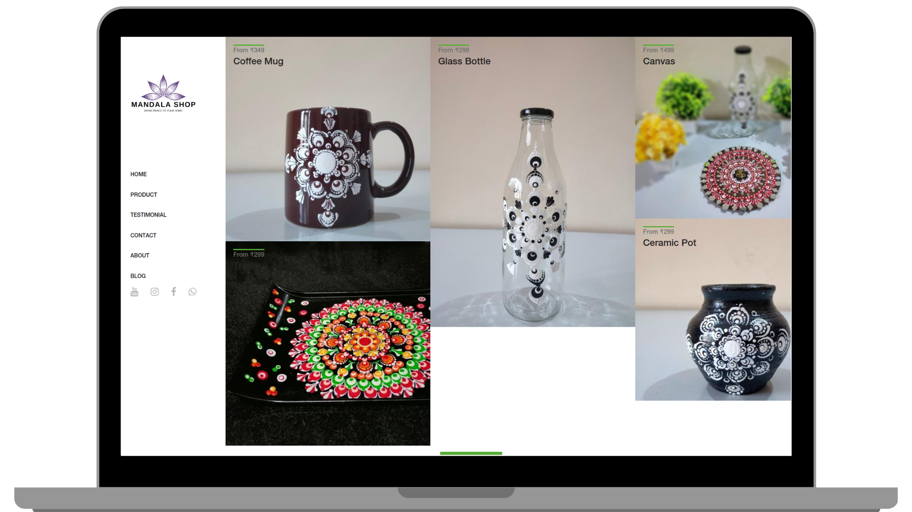

<h2 align="center">
  Mandala Shop 
  <a href="https://mandalashop.in" target="_blank">mandalashop.in</a>
</h2>

  

 

 &nbsp;
 &nbsp;

<h3 align="center">
    🔹
    <a href="https://github.com/curious-rishabh/Mandala-Shop/issues">Report Bug</a> &nbsp; &nbsp;
    🔹
    <a href="https://github.com/curious-rishabh/Mandala-Shop/issues">Request Feature</a>
</h3>

## Introduction

An eCommerce web application that provides a seamless and secure online shopping experience for customers, It have a robust product catalog and search functionality, with the ability to filter and sort products based on attributes such as category. It also include features such as fully automated delivery service, and order tracking.

This project was built using these technologies.

* HTML5
* CSS3
* Bootstrap5
* Javascript
* VsCode 

### Show your support

Give a ⭐ if you like this website!

